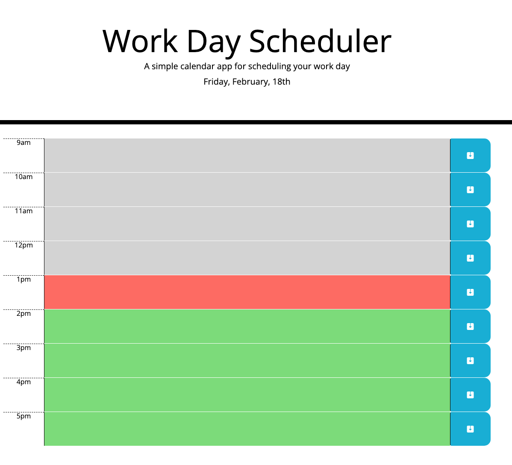

# Workday Scheduler

## Purpose 
Create a simple calendar application that allows the user to save events for each hour of the day. This app will run in the browser and feature dynamically updated HTML and CSS powered by jQuery.

## Technologies Used 
* HTML (starter code provided)
* CSS (starter code provided)
* JavaScript
* JQuery

## Deployed Application 
* Repo: https://github.com/lyndsclev/workday-scheduler
* App: https://lyndsclev.github.io/workday-scheduler/ 

## Images

